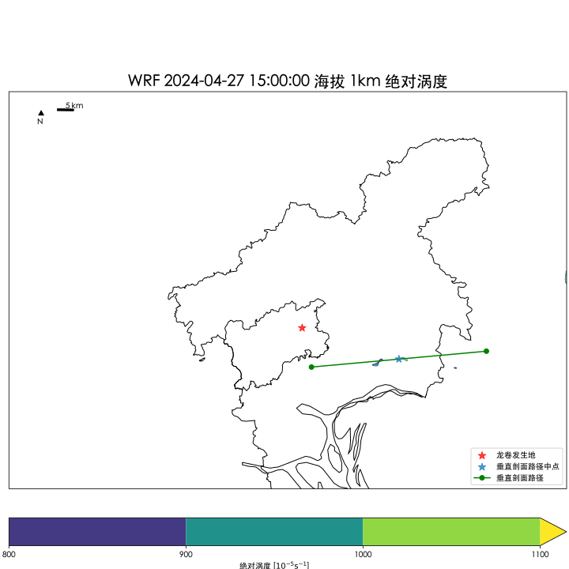

# BachelorThesis

我的本科毕业论文绘图代码

## 复现论文图片

1. 克隆本仓库到本地

   ```bash
   git clone https://github.com/BeiyanYunyi/BachelorThesis --recursive --depth 1
   ```

   如果你只需要参考代码而不需要实际运行，可以使用以下命令：

   ```bash
   git clone https://github.com/BeiyanYunyi/BachelorThesis --depth 1
   ```

   --recursive 选项用于克隆子模块，`--depth 1` 用于浅克隆，只克隆最新的提交历史，这样可以节省下载时间和空间。

2. 使用 [`uv`](https://docs.astral.sh/uv/) 安装依赖

   ```bash
   cd BachelorThesis
   uv sync
   ```

3. 查看系统中可用的中文字体

   ```bash
   uv run main.py
   ```

   这会输出系统中可用的中文字体列表。

4. 修改 `main.py` 中的注释，从而运行希望运行的函数。

## 参考代码

`lib` 目录中存放着所有的实际代码。其中，`lib/era5` 文件夹中存放着下载 ERA5 数据的代码，`lib/draw` 文件夹中存放着所有的绘图代码。各函数均有比较完备的注释以供参考。

## 子模块与来源

- [ChinaAdminDivisonSHP](https://github.com/GaryBikini/ChinaAdminDivisonSHP)
- [wrf-python](https://github.com/BeiyanYunyi/wrf-python)，修改自 [wrf-python](https://github.com/NCAR/wrf-python)

## 开源协议

除上述子模块以其原有协议开源外，本仓库的其余部分均使用 AGPL-3.0 协议开源。这意味着：

- 你可以自由使用、修改和分发本代码，但必须在分发时保留原作者信息（提供本项目地址 <https://github.com/BeiyanYunyi/BachelorThesis>），并且在修改后发布的代码也必须使用相同的 AGPL-3.0 协议。
- 如果修改了代码，并将其用于你论文的研究中，你需要在论文中（可以是致谢或附录）一并提供修改的代码（可以以链接的形式）。
- 如果没有修改代码，而是使用了本代码中的函数或方法，你需要在论文中注明使用了本代码，并提供链接。
- 本代码不提供任何形式的保证或支持，使用者需自行承担风险。

如果只是参考了本代码，你不需要在论文中注明，但仍然建议在附录或致谢中提及本仓库，以便其他人也能找到这些有用的资源。

## 图片示例


论文图 2.2 WRF - 离地 300m 反射率


论文图 4.1-4.3 - 等压面大尺度形势（高空）


论文图 4.4 - 海平面气压大尺度形势


论文图 4.5 - 大尺度整层水汽通量


论文图 4.7（部分） - 925hPa 湿区与 500hPa 干区


论文图 4.8-4.10 - 单站 T-lnP 图



论文图 4.11 - WRF - 海拔 1km 绝对涡度


论文图 4.12 - WRF - 垂直剖面风速与反射率
